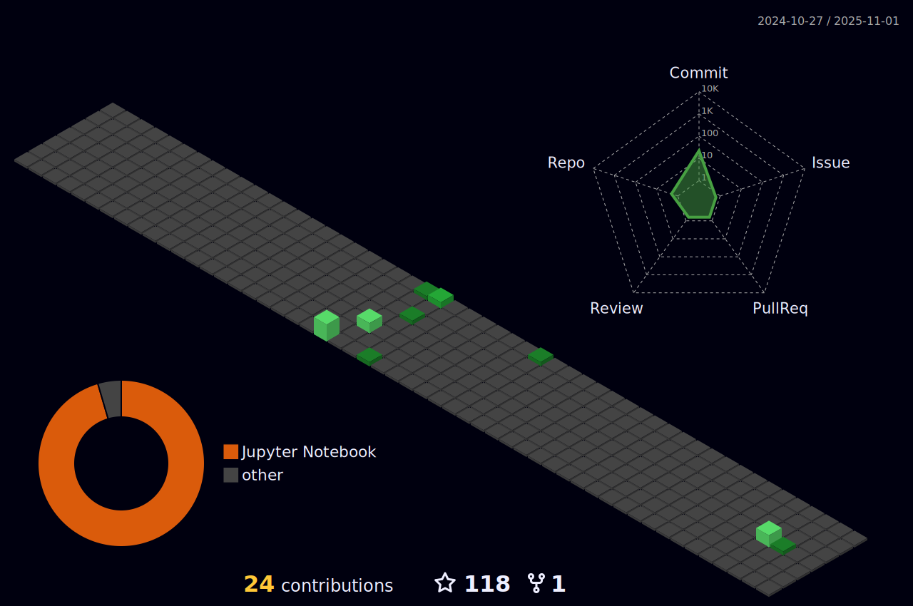

## 💻  About Me
- 👍   Exploring new technologies and solving software problems.
- ⌨️   Interested in Embeded systems, Digital Design, Machine Learning, Deep Learning, AI.
- 🎓   Studying at Ecole 42, Kocaeli University as a Electronic and Communication Engineer

  

<h4 align="left">Languages and Tools:</h3>

           

<!-- 

 -->

